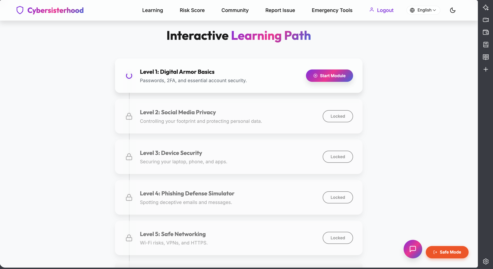
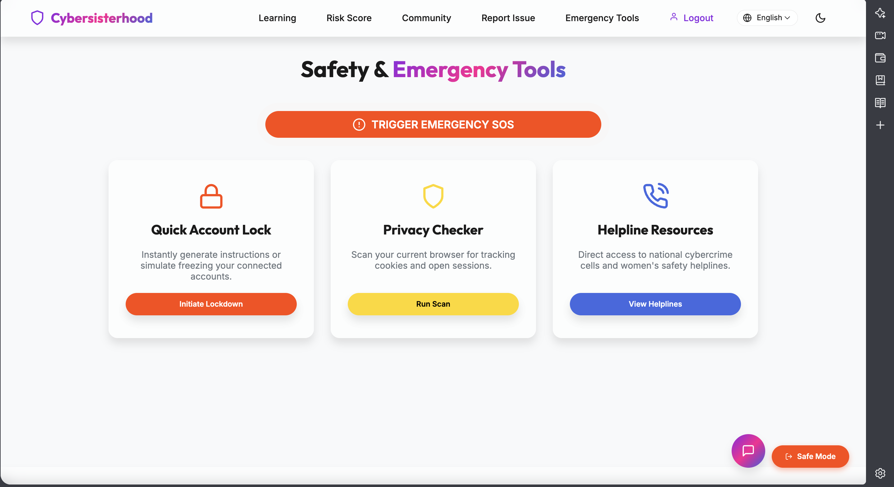
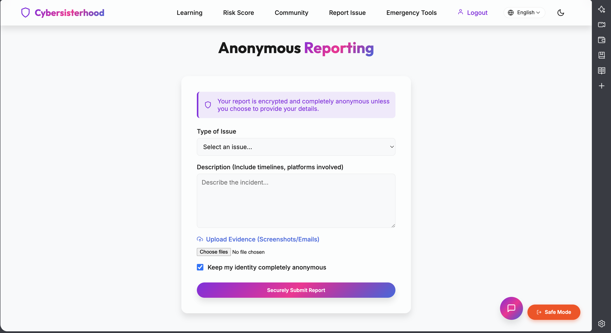
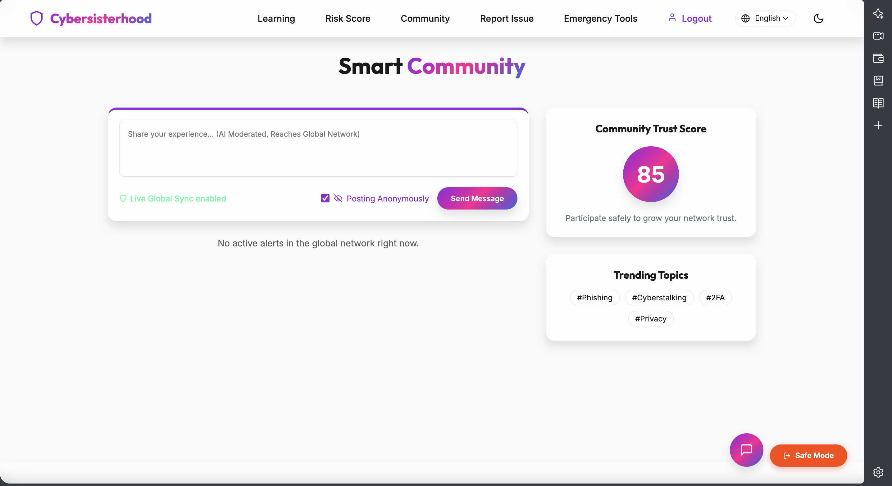

# 🛡️ CyberSister

> **CyberSister is a modern cybersecurity awareness platform designed to educate, engage, and empower users through an interactive and visually appealing web experience.**

---

## 🌐 Live Demo

🔗 **https://cybersisterhood18.netlify.app/**

---

## 📖 About the Project

CyberSister is a responsive cybersecurity awareness platform built with **React** and **Vite**. It combines modern UI/UX design, smooth animations, and educational content to deliver an engaging experience across desktop, tablet, and mobile devices.

The project focuses on promoting digital safety while maintaining clean design, accessibility, responsiveness, and performance.

---

## ✨ Key Features

- 📱 Fully Responsive Design
- 🌙 Dark Mode Interface
- ✨ Smooth UI Animations & Transitions
- 🎨 Modern & Clean User Interface
- ⚡ Fast Loading Performance
- 🖱️ Interactive User Experience
- 🔒 Cybersecurity-Themed Design
- ♿ User-Friendly Navigation
- 💻 Cross-Device Compatibility

---

## 🛠️ Tech Stack

### Frontend
- React
- Vite
- JavaScript (ES6+)
- HTML5
- CSS3

### UI & Styling
- CSS Flexbox
- CSS Grid
- CSS Animations
- CSS Transitions
- Responsive Web Design

### Deployment & Version Control
- Netlify
- Git
- GitHub

---

## 📸 Website Preview

### Home Page


---

### Learn Page


---

### Emergency Tools


---

### Dark Mode


---

### Cyber Risk Assessment


---

### Anonymous Reporting


---

### Smart Community


---

## 🚀 Run Locally

Clone the repository

```bash
git clone https://github.com/Krishna-Ghodake/cyber-sister.git
```

Install dependencies

```bash
npm install
```

Start the development server

```bash
npm run dev
```

---

## 📂 Project Structure

```
cyber-sister/
│
├── public/
├── src/
├── package.json
├── README.md
└── vite.config.js
```

---

## 👨‍💻 Developer

**Krishna Ghodake**

GitHub: https://github.com/Krishna-Ghodake

---

⭐ If you like this project, consider giving it a **Star**.
